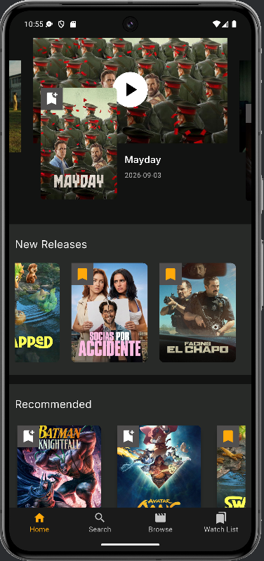
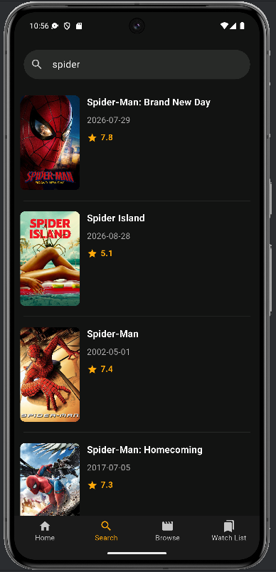
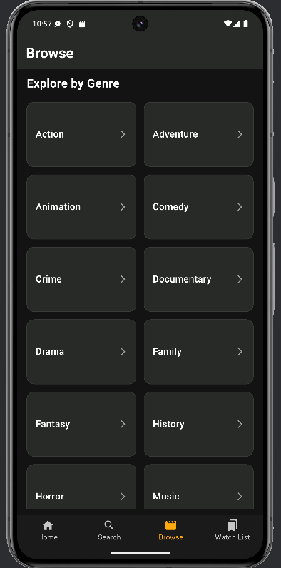
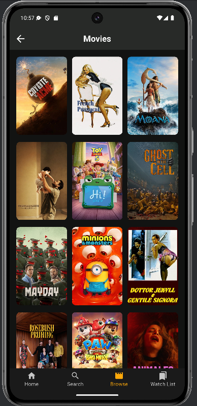
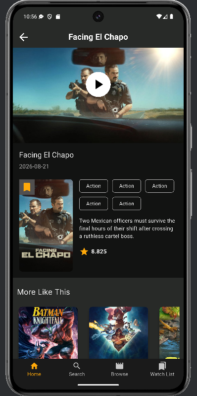
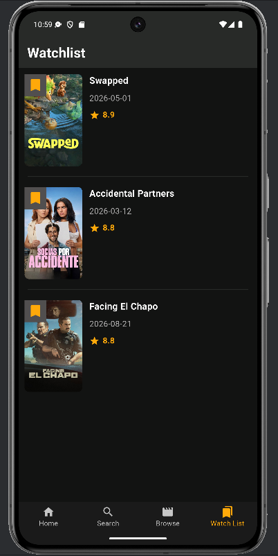

# Movies App

A Flutter movie application that allows users to browse and explore movies using data from the TMDB API. The application follows a Clean Architecture approach and uses BLoC/Cubit for state management, with Firebase Cloud Firestore for managing the user's Watch List.

## Features

* Browse popular movies
* Browse upcoming movies
* Browse new releases
* Search for movies
* View movie details
* Browse movies by genre
* Add movies to the Watch List
* Remove movies from the Watch List
* View saved movies in the Watch List
* Responsive UI using Flutter ScreenUtil
* Navigation between application sections using GoRouter

## Technologies

* Flutter
* Dart
* BLoC / Cubit
* Clean Architecture
* Dio
* TMDB API
* Firebase
* Cloud Firestore
* GoRouter
* Dartz
* Flutter ScreenUtil
* Google Fonts

## Architecture

The project follows a Clean Architecture approach to keep the application organized and maintainable.

The main layers are:

### Presentation

Contains the UI screens, widgets, and Cubits responsible for managing application state and updating the interface.

### Domain

Contains the application's core business models and entities, independent from external data sources.

### Data

Responsible for retrieving and converting data from external sources such as the TMDB API and Firebase.

### Repository

Defines the application's data access contracts and their implementations.

### Data Sources

Responsible for communicating with external services such as the TMDB API and Cloud Firestore.

The general flow of movie data is:

```text
UI
 ↓
Cubit
 ↓
Repository
 ↓
Data Source
 ↓
TMDB API
```

For the Watch List:

```text
UI
 ↓
Watch List State Management
 ↓
Repository
 ↓
Firebase / Cloud Firestore
```

## TMDB API

The application uses the TMDB API as the main source for movie information.

Movie data such as titles, posters, release dates, ratings, and other movie details are retrieved from TMDB and displayed throughout the application.

The application separates the external API models from the domain entities to keep the architecture organized.

## Watch List

The Watch List feature uses Firebase Cloud Firestore to store the movies saved by the user.

TMDB remains the main source for movie information, while Firestore is used to persist the user's Watch List data.

The application supports:

* Adding a movie to the Watch List
* Removing a movie from the Watch List
* Checking whether a movie is already saved
* Retrieving saved movies
* Displaying saved movies in the Watch List screen

The movie ID is used as the unique identifier for saved movies.

## Navigation

The application uses GoRouter for navigation between the main sections and screens.

The application includes sections such as:

* Home
* Browse
* Search
* Watch List
* Movie Details

## Main Screens

### Home

Displays different movie sections such as popular movies, upcoming movies, and new releases.

### Browse

Allows users to explore movies through the available browsing and genre functionality.

### Search

Allows users to search for movies using the TMDB API.

### Movie Details

Displays detailed information about a selected movie and provides the option to add or remove the movie from the Watch List.

### Watch List

Displays movies that the user has saved for later.

## Project Structure

The project is organized around features and clean architectural layers.

```text
lib/
├── core/
│   ├── constants/
│   ├── errors/
│   ├── route_manager/
│   └── web_service/
│
├── features/
│   ├── home/
│   │   ├── data/
│   │   ├── domain/
│   │   └── presentation/
│   │
│   ├── browse/
│   ├── search/
│   └── watch_list/
│
├── firebase_options.dart
└── main.dart
```

## Getting Started

### Prerequisites

Make sure you have the following installed:

* Flutter SDK
* Dart SDK
* Android Studio or another Flutter-compatible IDE
* A Firebase project
* A TMDB API key

### Installation

Clone the repository:

```bash
git clone <repository-url>
```

Navigate to the project directory:

```bash
cd movies_app
```

Install the dependencies:

```bash
flutter pub get
```
### Firebase Configuration

The application uses Firebase Cloud Firestore to manage the user's Watch List.

A Firebase project with Cloud Firestore enabled is required to run the Watch List functionality.

### TMDB Configuration

The application uses the TMDB API as the main source for movie data.

Make sure the required TMDB API configuration is provided before running the application.

### Run the Application

After completing the required configuration, run:

```bash
flutter run
```

## Screenshots

<p align="center">
  
  
  
</p>

<p align="center">
  
  
  
</p>

## Author

**Habiba Ihab**

Flutter Developer


## License

This project was created for learning and portfolio purposes.
